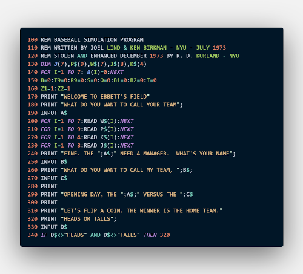
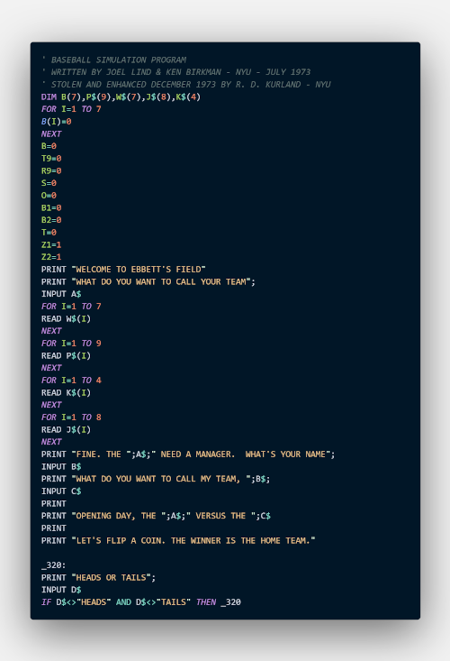
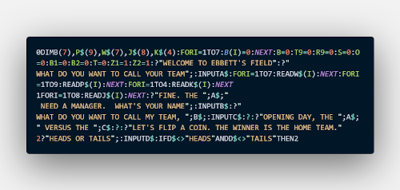

# BASIC Wrangler

A BASIC program listing line renumberer/cruncher (aka, a minifier).

**_This program is currently in beta testing._** It will probably break your program. The documentation is minimal. Things will change frequently.

What if you could turn this:

Into this:

And _then_ turn that into this:

With BASIC Wrangler, you can!

## Purpose

The purpose of BASIC Wrangler is to allow you to write BASIC programs using labels in a dialect-agnostic way. It also combines and crunches lines to take up the least amount of space, thus saving you memory. It is designed to be able to work with almost any dialect of line numbered BASIC.

## Basic Usage

To load the GUI, type `bw`. Type `bw -h` for CLI help. For more, check out [the Manual](docs/Manual.asc) in the docs directory.

## Some of the Planned Features

- [x] Built-in conversion from numbered listings routine
- [x] A GUI
- [x] Output to clipboard when pasting
- [ ] Preprocessor macros like includes and ifs
- [ ] Renaming variables
- [ ] Support for external tokenizers by accounting for how many bytes each token uses
- [x] Support for output to files that can be transferred directly into disk images
